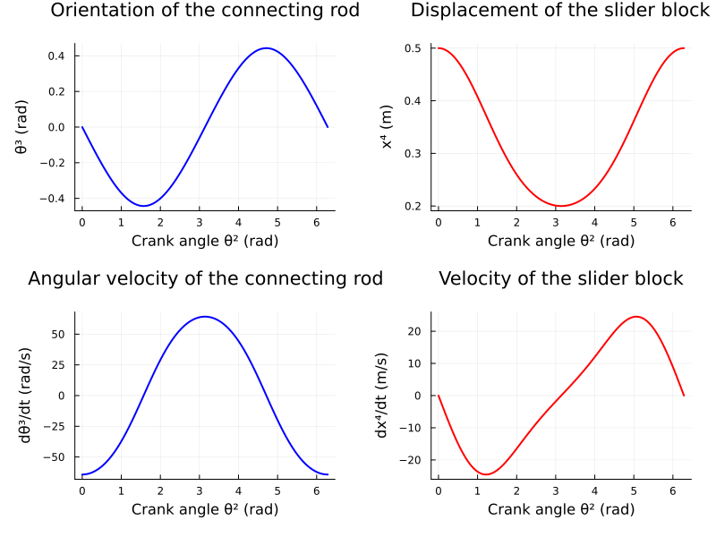

Christian DiPietrantonio
ME5180
Discussion 11
04/12/2026

//////////////////////////////////////////////////////////////////////////////////////////////////////////////////////////

Prompt:

[Kinematic solutions for a piston-crank system](https://cooperrc.github.io/dynamics/tutorials/14_piston-crank/)

In this notebook + video, we go through the analysis of a multibody dynamic simulation for piston-crank kinematics. We keep track of more variables (12 instead of 2-3), but we get a glimpse into how MBD systems and kinematic constraints can be handled in a more general sense of interacting rigid bodies. 

Can you recreate the graphs in [Shabana's prescribed_rotation_of_the_crankshaft](https://learning.oreilly.com/library/view/computational-dynamics-3rd/9780470686157/ch03.html#prescribed_rotation_of_the_crankshaft)? This is a great verification step that shows our solution process is repeatable. 

//////////////////////////////////////////////////////////////////////////////////////////////////////////////////////////

Response:

Using the results from the code that Professor Cooper used during the lecture video, we can most definitely recreate the graphs shown in Shabana's "Prescribed Rotation of the Crankshaft" example. Below are the results for the connecting rod and slider block. The position level plots show the connecting rod orientation and slider block displacement versus crank angle (as shown in Figures 3.37a and 3.37b of Shabana), and the velocity level plots show the anglular velocity of the connecting rod and velocity of the slider block versys crank angle (as shown in Figures 3.38a and 3.38b of Shabana). We can observe that these generally match the shapes and values as shown in Shabana's figures.

    

The code from lecture could also be updated to compute the accelerations for each body by taking the time derivative of the velocity constraint equation and solving the resulting linear system at each time step. Nevertheless, the plots above demonstrate the agreement between our simulation results and those shown in Chapter 3 of the text. In chapter 3, other plots show the position, velocities, and accelerations of other bodies (the crankshaft/connecting rod) in the system versus time. These plots can alo be recreated using the results from the code generated in lecture and using the same process as used to create the plots above!
